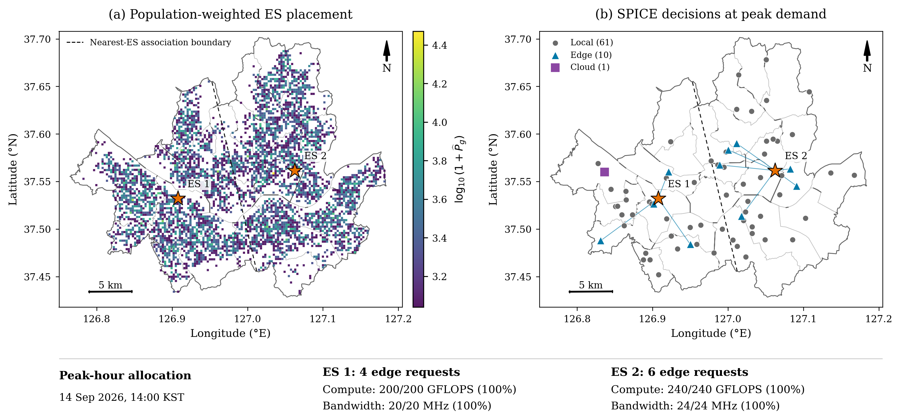

# SPICE Seoul Map Files

Geographic visualization files accompanying **Figure 6** of:

> **SPICE: Quality-Aware Dynamic Pricing and Resource Allocation for DNN Inference in Heterogeneous Edge-Cloud Networks**

The maps show population-weighted edge-server placement in Seoul and the inference execution choices of sampled AI mobile users (AMUs).

## Download

- [Combined map for Google Earth (KMZ)](SPICE_Seoul_Experiment.kmz?raw=1)
- [Figure 6 (PDF)](figure6.pdf?raw=1)
- To download all files, select **Code > Download ZIP** at the top of this repository and extract the archive.

## Files

| File | Contents |
| --- | --- |
| [population_part_1.kml](population_part_1.kml?raw=1) | First population layer, containing 1,942 grid placemarks. |
| [population_part_2.kml](population_part_2.kml?raw=1) | Second population layer, containing 1,942 grid placemarks. |
| [sites_and_peak_decisions.kml](sites_and_peak_decisions.kml?raw=1) | Edge servers, district boundaries, association regions, sampled AMUs, and edge-execution links. |
| [SPICE_Seoul_Experiment.kmz](SPICE_Seoul_Experiment.kmz?raw=1) | Combined population and decision layers for Google Earth. |
| [figure6.pdf](figure6.pdf?raw=1) | Vector version of the figure. |
| [figure6.png](figure6.png?raw=1) | Figure preview. |

## Open in Google My Maps

1. Download and extract the repository ZIP.
2. Open [Google My Maps](https://mymaps.google.com/) and create a map.
3. Import `population_part_1.kml` into the first layer.
4. Add a second layer and import `population_part_2.kml`.
5. Add a third layer and import `sites_and_peak_decisions.kml`.
6. Select a request placemark to inspect its inference configuration and outcome.

Import the three KML files as separate layers. Each population layer contains fewer than 2,000 placemarks.

## Open in Google Earth

Download `SPICE_Seoul_Experiment.kmz` and open it in Google Earth. The combined file organizes population grids, server locations, and inference decisions into folders that can be toggled individually.

## Experiment represented by the maps

| Item | Setting |
| --- | --- |
| Population data window | September 11-17, 2026 |
| ES placement window | First 72 hours |
| Evaluation window | Subsequent 96 hourly snapshots |
| Displayed decision snapshot | September 14, 2026, 14:00 KST (UTC+9) |
| Requests in the displayed snapshot | 72: 61 local, 10 edge, and 1 cloud |
| ES 1 allocation | 4 requests; 200 GFLOPS and 20 MHz |
| ES 2 allocation | 6 requests; 240 GFLOPS and 24 MHz |
| Population layer | 3,884 grid placemarks across two KML files |
| Map coordinates | WGS84 longitude and latitude, converted from EPSG:5179 |

The Seoul living-population grids determine spatial sampling weights and hourly demand. Weighted k-means places the two logical ESs, whose positions remain fixed during evaluation. Each sampled AMU submits one inference request and is associated with its nearest ES. The decision layer records the execution choices produced by SPICE.

The displayed snapshot is the earliest maximum-demand snapshot in the first uplink mapping that includes local, edge, and cloud execution. Request placemarks include the selected DNN model, partition, execution mode, latency, device energy, and payment.

## Data sources

- **Seoul Metropolitan Government, 250-m living population:** [Seoul Open Data Plaza, dataset OA-22784](https://data.seoul.go.kr/dataList/OA-22784/S/1/datasetView.do).
- **Official grid centers and administrative boundaries:** [Seoul living-population grid viewer](https://data.seoul.go.kr/opendata/seoulStay/grid_viewer.html).
- **Measured 5G uplink conditions used in the experiment:** H. Schippers, M. Geis, S. Boecker, and C. Wietfeld, "DoNext: An Open-Access Measurement Dataset for Machine Learning-Driven 5G Mobile Network Analysis," *IEEE Transactions on Machine Learning in Communications and Networking*, vol. 3, pp. 585-604, 2025. [DOI: 10.1109/TMLCN.2025.3564239](https://doi.org/10.1109/TMLCN.2025.3564239).

Population grids and district boundaries originate from the Seoul Metropolitan Government. ES placement, sampled AMU locations, and inference decisions are simulation outputs. Google My Maps and Google Earth display the supplied geographic layers.

For import details, see the [Google My Maps import guide](https://support.google.com/mymaps/answer/3024836?hl=en). When using these materials, cite the accompanying SPICE manuscript and the relevant original data sources above.
